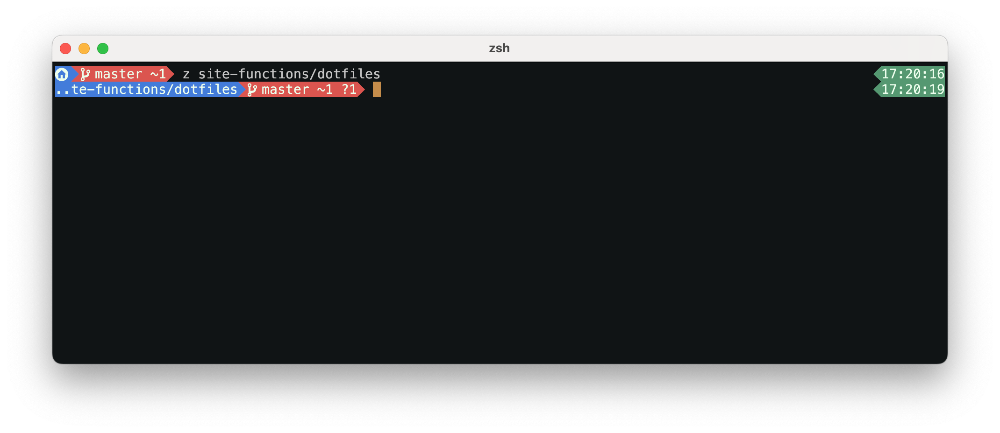

# ZSH PROMPT

## Overview

This is a ZSH prompt customization script that provides a styled prompt with Git
status integration, Python virtual environment display, and command exit status
indicators.

## Usage

Source the script in your `.zshrc`:
```zsh
source /path/to/zsh_prompt
```

### Screenshots
An example of what the zsh prompt looks like in action



## Architecture

The single file `zsh_prompt` follows a declarative configuration pattern:

1. **ZZ_PROMPT associative array** - Configuration for colors, glyphs, and behavior
2. **Helper functions** - `M()` retrieves config, `F()`/`K()` set
   foreground/background colors, `R()` resets colors
3. **Prompt builders** - Modular functions (`ps1a`, `ps1b`, `rps1a`, `rps1b`)
   that compose the final prompt
4. **Hooks** - `precmd_functions` triggers prompt rebuild before each command

### Key Configuration Keys

| Key | Purpose |
|-----|---------|
| `[b]` | PWD background color |
| `[g~]`/`[go]` | Git dirty/clean background colors |
| `[gs]` | Git status line (populated by `dotfiles stline`) |
| `[cv]` | Venv color when outside project folder |

### External Dependency

The `precmd()` hook calls `dotfiles stline` which populates `_ZD[prompt]` with
git status. This command must be available for git integration to work.

### Terminal Compatibility

The `R()` function includes a workaround for macOS Terminal.app color
brightening issue (not needed for Kitty or truecolor terminals).
