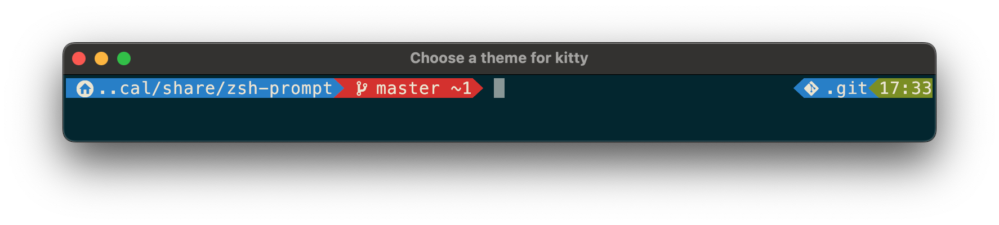
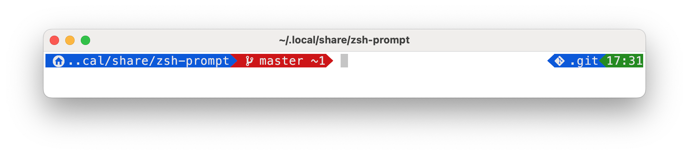

# Zsh PROMPT

## Overview

This is a Zsh prompt customization script that provides a styled prompt with Git
status integration, Python virtual environment display, and command exit status
indicators.

## Install

```zsh
mkdir -p $HOME/.local/share
git clone https://github.com/broeknbytes/zsh-prompt.git $HOME/.local/share/zsh/prompt
```

Add to your .zshrc if not already:

```zsh
echo '[[ -f $HOME/.local/share/zsh/prompt/zsh-prompt ]] && source $HOME/.local/share/zsh/prompt/zsh-prompt' >> ~/.zshrc
```

### Screenshots
An example of what the Zsh prompt looks like in action

| Dark | Light |
| --- | --- |
|  |  |

## Architecture

The entire implementation lives in `zsh-prompt` (a shell script, not a Zsh plugin framework). Key structure:

- **`_ZZ_PROMPT` associative array** (top of file): All configuration — colors, glyphs, widths. Keys use short mnemonics (`[b]` = PWD background, `[gx]`/`[go]` = git dirty/clean colors, `[gc]` = computed git color, `[f]` = computed text color for dark/light mode).
- **Helper functions**: `M()` reads config (with optional Kitty glyph scaling via `\e]66;...`), `F()`/`K()`/`R()` handle Zsh color escapes. `R()` includes a Terminal.app workaround for color brightening.
- **Prompt segments**: `_ps1a` (left: path), `_ps1b` (left: git status with powerline glyphs), `_rps1a` (right: venv or git repo path), `_rps1b` (right: time + exit status).
- **`precmd()`**: Runs before each prompt — calls `dotfiles --zsh-prompt` to populate `_ZD[prompt]` with git info, detects macOS dark mode via `defaults read -g AppleInterfaceStyle`, computes `[gc]` and `[gs]`.
- **`precmd_functions`**: Hooks `_ps1` and `_rps1` to rebuild PS1/RPS1 each prompt.
- **`_chpwd_update`**: Updates terminal title on directory change.

## External Dependencies

Single dependency [dotfiles](https://github.com/broeknbytes/dotfiles.git) 

- `dotfiles --zsh-prompt`: Populates `_ZD[prompt]` (git status) and `_ZD[gitdir]` (repo path). If unavailable, falls back to `git_stline()` which parses `$porcelain` (expected to be git porcelain output).
- `_ZD` associative array: Set externally by the `dotfiles` command; keys used are `[prompt]`, `[gitdir]`, `[track]`.

## Key Conventions

- Powerline glyphs (`\ue0b0`, `\ue0b2`) for segment separators; Nerd Font glyphs for icons.
- Kitty-specific glyph scaling uses the `\e]66;...` escape sequence (triggered when `$KITTY_WINDOW_ID` is set).
- Path display truncates using Zsh `%width<..< ` truncation from the left.
- Performance timing functions (`_time_ps1`, `_time_rps1`) exist for profiling; swap them into `precmd_functions` to measure.
