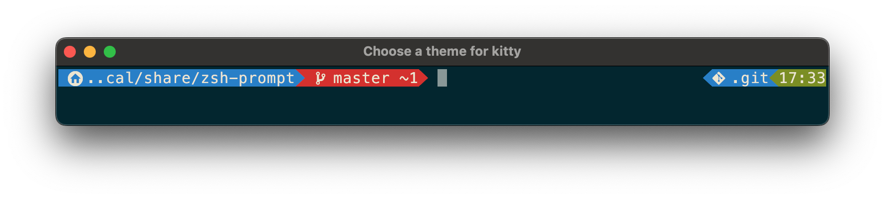
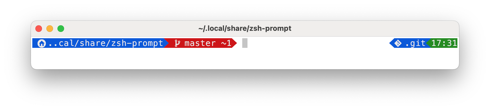

# Zsh Prompt

## Overview

This is a Zsh prompt customization script that provides a styled prompt with Git
status integration, Python virtual environment display, and command exit status
indicators.

## Install

```zsh
mkdir -p $HOME/.local/share
git clone https://github.com/amazebb/zsh-prompt.git $HOME/.local/share/zsh/prompt
```

Add to your .zshrc if not already:

```zsh
echo '[[ -f $HOME/.local/share/zsh/prompt/zsh-prompt ]] && source $HOME/.local/share/zsh/prompt/zsh-prompt' >> ~/.zshrc
```

### SSH

Terminal.app on macOS 15 and earlier brightens coloured text drawn on the
default background; `R()` works around it. Over ssh the remote can't see the
local terminal, so the prompt exports `LC_OS` and `LC_TERM_PROGRAM` locally
and relies on ssh to forward them.

Apple's `/usr/bin/ssh` and sshd already forward `LC_*`. Other clients, such as
Homebrew's OpenSSH, need this in `~/.ssh/config`:

```
Host *
    SendEnv LANG LC_*
```

The remote sshd must have `AcceptEnv LANG LC_*` (the macOS default, in
`/etc/ssh/sshd_config.d/100-macos.conf`).

### Screenshots
An example of what the Zsh prompt looks like in action

| Dark | Light |
| --- | --- |
|  |  |

## Configuration

All options are in the commented `_ZZ_PROMPT` array at the top of
`zsh-prompt`. Override them in `.zshrc` after the `source` line (sourcing
resets the array):

```zsh
_ZZ_PROMPT[width]=60    # left prompt width
_ZZ_PROMPT[nf]=off      # plain text instead of Nerd Font glyphs
_ZZ_PROMPT[gv]=right    # git segment: left, right or off
_ZZ_PROMPT[sv]=ip       # ssh segment: host (user@host), ip (user@server ip) or off (glyph only)
_ZZ_PROMPT[b]='#5f00af' # PWD background
```

## Architecture

The entire implementation lives in `zsh-prompt` (a shell script, not a Zsh plugin framework). Key structure:

- **`_ZZ_PROMPT` associative array** (top of file): user configuration — colors, glyphs, widths. Keys use short mnemonics (`[b]` = PWD background, `[gx]`/`[go]` = git dirty/clean colors, `[f]` = text color, `[width]` = left prompt width, `[dn]` = repo/venv depth limit).
- **`_ZZ_STATE` associative array**: runtime state set each prompt — `[gs]` git status line, and `_ZZ_PROMPT` key names for `[gg]` git glyph, `[gc]` git background, `[k]` current segment background, `[xs]` exit-status background.
- **Helper functions**: `M()` reads config, `F()`/`K()`/`R()` handle Zsh color escapes. `R()` includes a Terminal.app workaround for color brightening. `_esc()` makes untrusted text (paths, branch, repo, venv) literal in PS1.
- **Prompt segments**: `_ps1` (left: user, path via `_pwd_fit`, venv, git) and `_rps1` (right: optional venv, time + exit status).
- **Hooks**: `_git_pre _last_exit_status _ps1 _rps1` are appended to `precmd_functions`, and `_chpwd_update` (terminal title) to `chpwd_functions`, with `typeset -gaU` so re-sourcing doesn't duplicate them. `_git_pre` calls `dotfiles --zsh-prompt`, or the `_git_stline` fallback.

## External Dependencies

Single dependency [dotfiles](https://github.com/amazebb/dotfiles.git)

- `dotfiles --zsh-prompt`: Populates `_ZD[prompt]` (git status) and `_ZD[gitdir]` (repo path). If unavailable, falls back to `git_stline()` which parses `$porcelain` (expected to be git porcelain output).
- `_ZD` associative array: Set externally by the `dotfiles` command; keys used are `[prompt]`, `[gitdir]`, `[track]`.

## Key Conventions

- Powerline glyphs (`\ue0b0`, `\ue0b2`) for segment separators; Nerd Font glyphs for icons.
- Kitty-specific glyph scaling uses the `\e]66;...` escape sequence (triggered when `$KITTY_WINDOW_ID` is set).
- Path display truncates using Zsh `%width<..< ` truncation from the left.
- Performance timing functions (`_time_ps1`, `_time_rps1`) exist for profiling; swap them into `precmd_functions` to measure.
